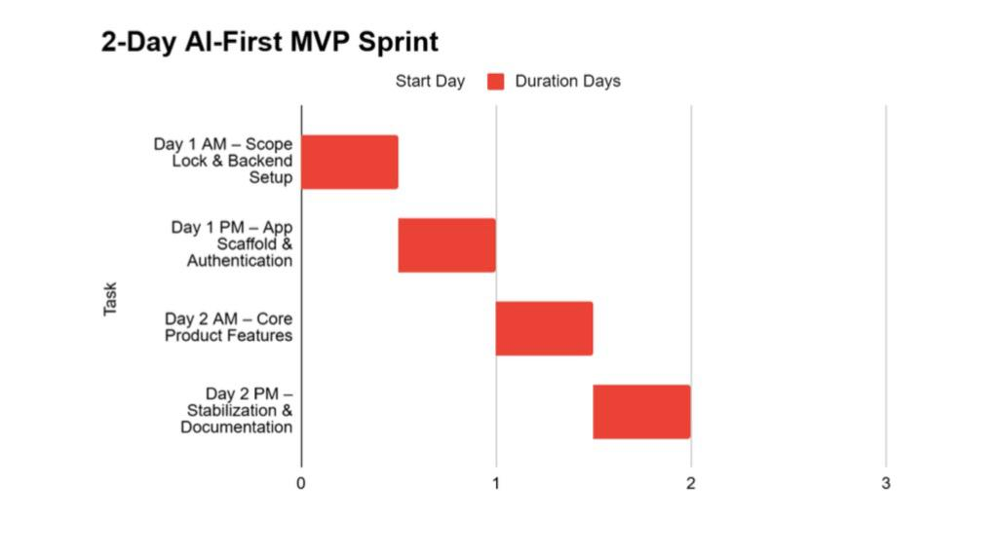
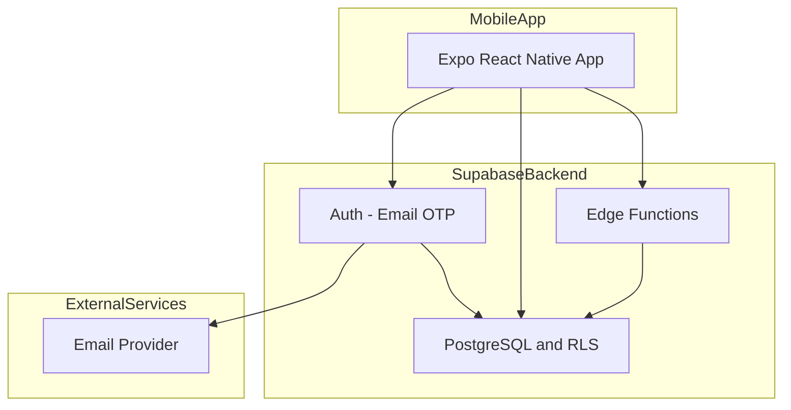
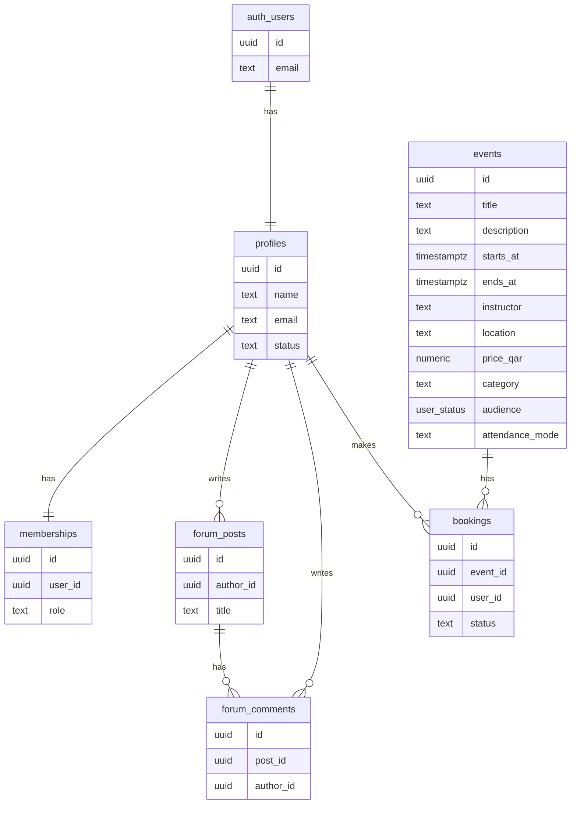

# The Mom Club MVP — Part 2 & Part 3 Deliverable

**Part 2: Timeline & Gantt**  
**Part 3: Architecture & Supabase Design**

---

## 2 Day Execution Plan

1. **Day 1 AM — Plan & Setup**  
   Users, roles, MVP scope, in/out of scope. Outputs: product brief, scope list, role matrix. Start Supabase project setup and schema design.

2. **Day 1 PM — Backend Implementation**  
   Complete database schema, RLS policies, Edge Functions (onboarding-complete, validate-membership). Expo app shell with tab navigation. Use AI (e.g. Cursor to code, ChatGPT Agent 4.0 to write plans).

3. **Day 2 AM — Core App & Auth**  
   Get login (Email/OTP) and all roles (guest, free, member, admin) working. Onboarding flow and role-based context. Identity and access must be complete before business logic.

4. **Day 2 PM — Features & Testing**  
   Forums (list, detail, create, comment), events (list, detail, booking), profile screen. Integrate testing throughout. Bug fixes, quick UX polish, documentation and AI disclosure.

---

## Condensed Gantt Chart

**Timeline Overview:** This 2-day sprint follows an AI-first development approach with four distinct half-day phases. Day 1 AM focuses on locking scope and setting up the backend infrastructure. Day 1 PM builds the app scaffold and implements authentication. Day 2 AM delivers core product features (forum, events, profile). Day 2 PM focuses on stabilization, testing, and comprehensive documentation.

---

## Milestones (Half-Day Blocks)

| Block | Milestone | Deliverables |
|-------|-----------|--------------|
| **Day 1 AM** | **Plan & Setup** | Users and roles (guest, free, member, admin); MVP scope (in/out); product brief; start Supabase project and schema design. Plan first, then setup. |
| **Day 1 PM** | **Backend Implementation** | Complete schema (profiles, memberships, forum_posts, forum_comments, events, bookings), all RLS policies, 2 Edge Functions (onboarding-complete, validate-membership), Expo app shell with tab navigation. AI: Cursor for code, ChatGPT for plans. |
| **Day 2 AM** | **Core App & Auth** | Auth screen (Email/OTP), onboarding flow, membership creation, role-based context. All roles (guest, free, member, admin) working so business logic can assume identity is complete. |
| **Day 2 PM** | **Features & Testing** | Forum (list, detail, create, comments), events (list, detail, booking), profile screen. Integrate testing throughout development. Bug fixes, minimal polish, README, AI disclosure. |

---

## Parallel Execution

- **Day 1 AM:** Planning is sequential, but schema design can start while finalizing scope documentation.
- **Day 1 PM:** Schema + RLS can be done in parallel with Expo shell setup (one person can alternate; two could split backend vs frontend).
- **Day 2 PM:** Forum and Events screens can be developed in parallel once auth and navigation exist. Testing is integrated throughout rather than a separate phase.

---

## AI Leverage Points

| Area | How AI was used | Time saved |
|------|------------------|------------|
| **Planning** | ChatGPT Agent 4.0 for product brief, scope, role matrix, Gantt structure | ~3 h |
| **Schema, auth and RLS** | Cursor/AI (Opus 4.5, sonnet) to generate PostgreSQL schema and RLS from role rules | ~30 min |
| **Boilerplate** | Cursor for Expo screens, Supabase client, TypeScript types | ~3 h |
| **Edge Functions** | AI (Opus 4.5, ...) for Deno functions and auth checks | ~1 h |
| **UI and flows** | Cursor (gemeni 3 pro, ...) for forms, cards, modals, navigation | ~3 h |
| **Documentation** | AI (sonnet 4.5,... ) for README, setup, API notes | ~2 h |

**Tools:** Cursor for implementation; ChatGPT Agent 4.0 for plans and structure.  
**Total estimated time saved: ~12 hours.**

---

## Trade-Offs to Hit the 2-Day Deadline

| Feature | MVP choice | Reason |
|---------|------------|--------|
| Payments | Mock modal only | Real Stripe adds 4–6 h and compliance |
| Images | External URLs (e.g. Unsplash) | No storage/CDN (~3–4 h) |
| Push / email notifications | Skipped | FCM/email setup ~2–3 h each |
| Real-time | Async forum only | Realtime/WebSockets ~4–5 h |
| Advanced search | Basic list only | Full-text ~2–3 h |
| Multi-step onboarding | Single screen | Scope control (~2 h saved) |
| TestFlight | Expo Go / Replit | Build + review ~2–4 h |
| UI polish | Minimal styling | Focus on functional over beautiful |
| Separate testing phase | Integrated testing | Test while building, not after |
| Forum likes/reactions | Posts and comments only | Additional interactions add complexity |
| Home screen polish | Simple content cards | Elaborate layouts require more time |

---

# Part 3 — Architecture & Supabase Design

## Stack (Mandatory)

- **Mobile app:** React Native (Expo)
- **Backend:** Supabase
- **Dev environment:** Replit

---

## Architecture Overview

### System Diagram

**Architecture Overview:** The system consists of three main layers: (1) **Mobile App** - Expo React Native client handling all user interactions, (2) **Supabase Backend** - Authentication, PostgreSQL database with Row Level Security, and Edge Functions for business logic, (3) **External Services** - Email provider for OTP delivery. All data access is secured through RLS policies that enforce role-based permissions at the database level.

---

## Authentication

- **Method:** Email / OTP (magic link or code).
- **Roles (in `memberships.role`):** guest, free, member, admin.
- **User statuses (in `profiles.status` / `user_status` enum):** pregnant, new_mom, planning.
- **Flow:** Sign in → profile created (trigger) → onboarding → Edge Function sets profile + creates membership (free). Role is read from `memberships` for all gating.
- **Signup helper:** Database function `public.email_exists(TEXT)` prevents existing users from going through the sign-up flow again.

---

## Users and Roles (Planned Up Front)

Defined before build so schema and RLS match:

| Role | Who | Forum | Events | Book | Profile / Admin |
|------|-----|-------|--------|------|------------------|
| **Guest** | Not signed in | Read only | Read only | No | No |
| **Free** | Signed up, not paid | Read, post, comment | Read only | No | Own profile, upgrade CTA |
| **Member** | Paid | Read, post, comment | Read, book | Yes | Own profile, membership |
| **Admin** | Elevated | + Moderate (delete any) | + Manage (CRUD) | + All bookings | + All profiles/memberships |

User status (`profiles.status`) uses the `user_status` enum with values `pregnant`, `new_mom`, and `planning` (for users who are still planning and not yet pregnant or a new mom).

---

## Database Schema (Minimum)

**Database Structure:** `auth.users` (Supabase), `profiles`, `memberships`, `forum_posts`, `forum_comments`, `events`, `bookings`. “users” = `auth.users`; app data uses `profiles` linked by `id`.

---

## Security: RLS and Role-Based Access

- **RLS:** On all public tables; policies use `auth.uid()` and `get_my_role()` (from `memberships.role`).
- **Role-based access:** Guest = read forum/events; Free = + post/comment; Member = + book; Admin = + moderate and manage.

| Role   | Read forum & events | Post & comment | Book events | Moderate & manage |
|--------|---------------------|----------------|-------------|--------------------|
| Guest  | Yes                 | —              | —           | —                  |
| Free   | Yes                 | Yes            | —           | —                  |
| Member | Yes                 | Yes            | Yes         | —                  |
| Admin  | Yes                 | Yes            | Yes         | Yes                |

**Permission Model:** This table summarizes the role-based access control enforced by RLS policies. Each role inherits permissions from lower roles and adds new capabilities: **Guest** can only read public content, **Free** adds posting and commenting, **Member** adds event booking, and **Admin** adds full moderation and management capabilities. All permissions are enforced at the database level via the `get_my_role()` function, ensuring security even if the UI is bypassed.

---

## Edge Functions (At Least 2)

1. **onboarding-complete**  
   **Purpose:** Onboarding completion and role setup.  
   **Input:** Auth token + body (name, status, due_date, baby_age).  
   **Logic:** Upsert `profiles` (set `onboarding_completed_at`), upsert `memberships` with role `free`.  
   **Role-based logic:** Ensures every completed onboarding user gets a membership and free-tier access.

2. **validate-membership**  
   **Purpose:** Membership access validation.  
   **Input:** Auth token.  
   **Logic:** Read `memberships.role`; return `{ allowed, role }` (e.g. for booking: member/admin allowed).  
   **Role-based logic:** Single place to check if user can access member-only features.

Security is enforced by RLS; Edge Functions support onboarding and validation. UI gating uses role from `memberships` via client.

---

## What Was Simplified and Why

| Area | Simplified | Reason |
|------|------------|--------|
| **Users** | No separate `users` table in public schema | Use `auth.users` + `profiles`; one less table. |
| **Onboarding** | One screen (name, status, due date/baby age) | Fits 2–3 day scope. |
| **Forum** | Posts + comments only | No likes/reactions/nested threads. |
| **Events** | Single table, no recurring | Recurring adds complexity. |
| **Bookings** | No payment; status “confirmed” | Real payments need Stripe and compliance. |
| **Admin** | Role in `memberships` only | One source of truth for roles. |
| **Storage** | No file uploads in MVP | No Storage bucket/CDN in first deliverable. |

---

## Summary

- **Part 2:** Aggressive 2-day plan: **Plan & Setup** (Day 1 AM: users, roles, MVP scope, start schema), **Backend Implementation** (Day 1 PM: complete schema, RLS, Edge Functions, app shell), **Core App & Auth** (Day 2 AM: auth, onboarding, role context), **Features & Testing** (Day 2 PM: forum, events, profile with integrated testing). Gantt and milestones condensed to 4 half-day blocks. Includes parallel execution opportunities, AI use (Cursor + ChatGPT Agent 4.0), aggressive trade-offs for 2-day deadline, and a **PM improvement** section: critical lessons for ultra-tight timelines (ruthless scope management, integrated testing, parallel work).
- **Part 3:** Architecture diagram, users/roles table, schema diagram, RLS and role-based access, two Edge Functions (onboarding-complete, validate-membership), and simplifications with reasons.

This deliverable reflects a plan-first, auth-first, then features-with-testing approach optimized for a strict 2-day deadline.
